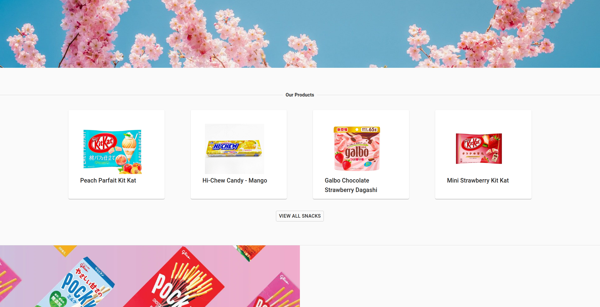
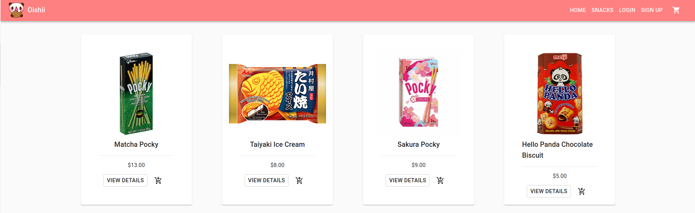
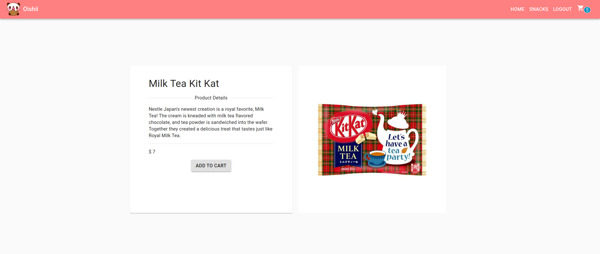
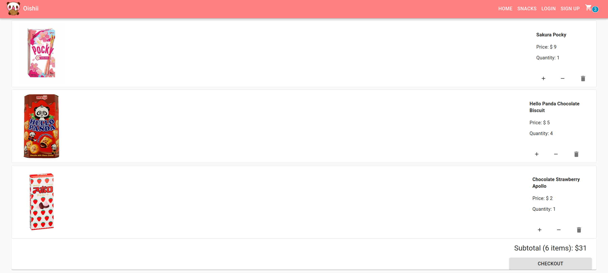

# Oishii Snacks

## Introduction

Oishii Snacks is an e-commerce site for users to browse and purchase from a variety of Japanese snacks! The site simulates the shopping experience for both members as well as guests. Users can view details about our snacks, add to cart, checkout, and more.

- Check out our site here: [Oishii Snacks](https://oishii-snacks.herokuapp.com/)

- You can also watch our presentation here: [Oishii Snacks Presentation](https://www.youtube.com/watch?v=cuoRInoCywc)

## Tech Stack

- JavaScript
- React
- Redux
- PostgreSQL
- Sequelize
- Express
- Node.js

## Features

As a customer, I can:

- View all available products so I can pick from a variety.
- View details about a single product.
- View featured products on the homepage.
- Add a product to my cart, as a guest or as a member.
- See how many items are in my cart by viewing the navbar.
- View the products in my cart as well as a subtotal.
- Edit the products in my cart by changing the quantity or removing a product.
- Checkout the items in my cart, as a guest or as a member.
- Create an account so I can have a logged-in experience.
- Have a persistent cart so I can pick up where I left off.
- Feel assured that my personal details and cart data can only be viewed and edited by me.

**Featured Products View**

**All Products View**

**Single Product View**

**Cart View**

### Run This Project Locally

1. Fork and clone this repo. `npm install`
2. Create a database using: `createdb oishii`
3. Seed the database using: `npm run seed`
4. Run the application with: `npm run start:dev`

### Next Steps

- Make UI more responsive so users can shop on smaller screens.
- Add filtering functionality to give users more control over their shopping experience.
- Integrate payment processing (e.g. Stripe) for a more realistic experience.
- Build an admin dashboard where products can be edited and added.
